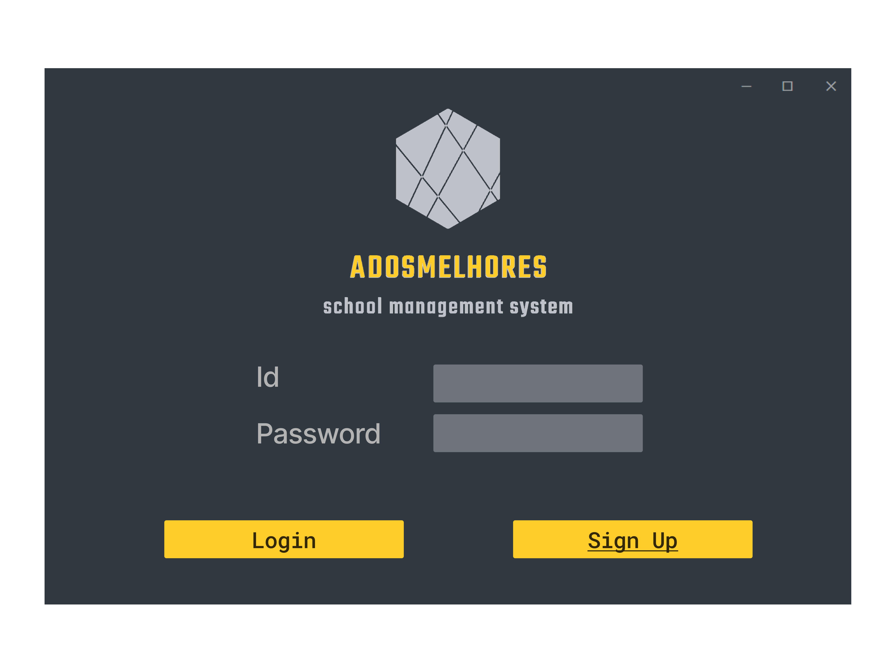
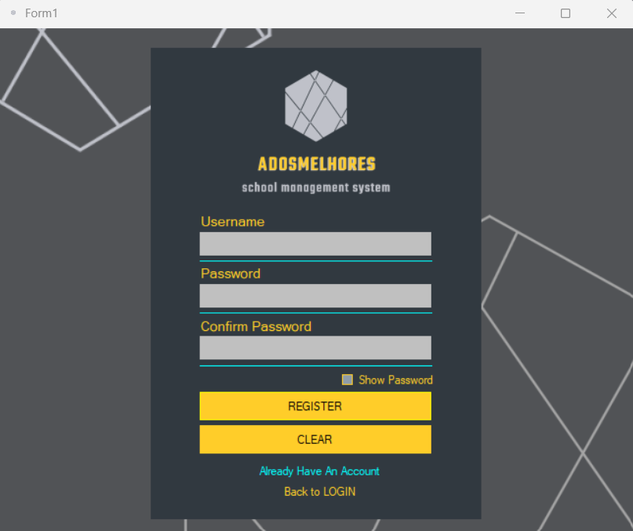
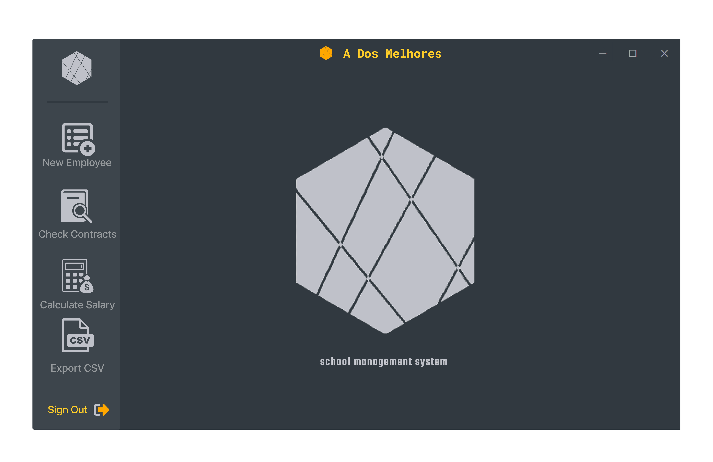
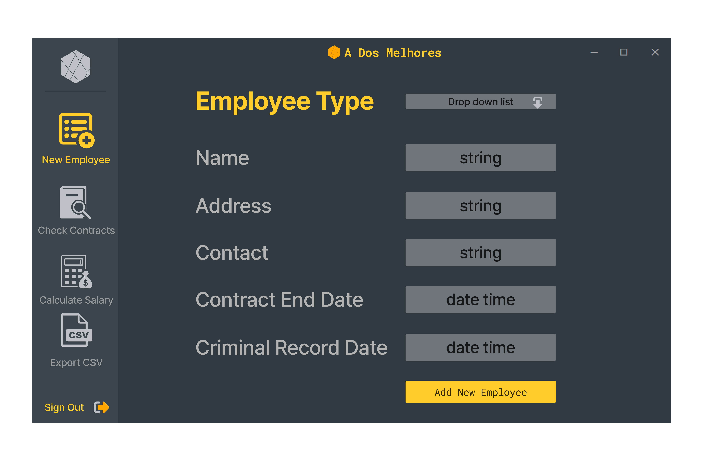
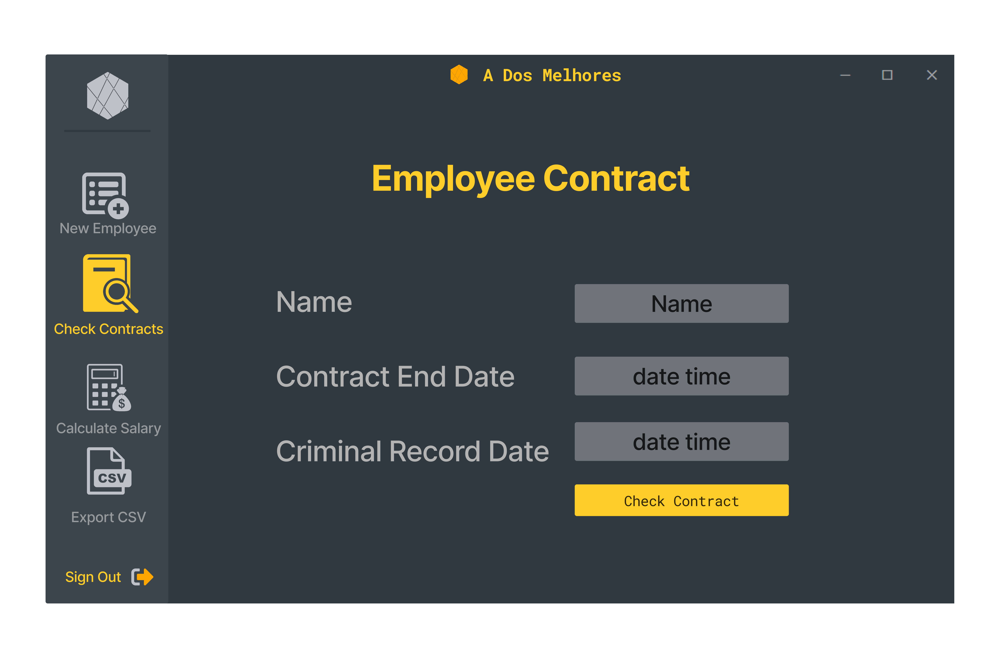
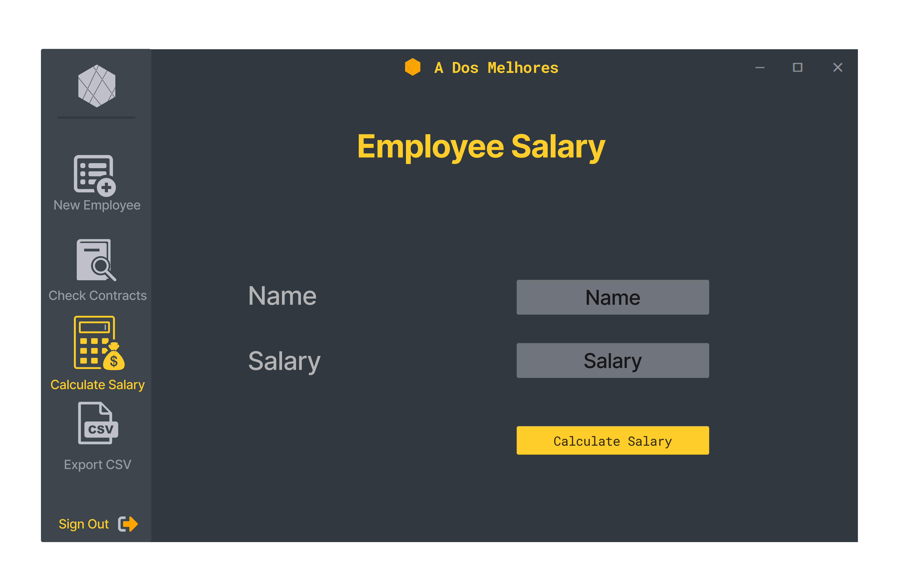
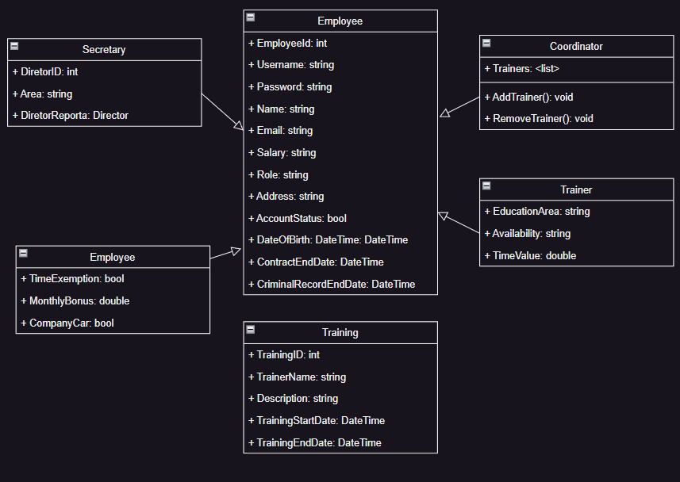

# Academia de Formação Asset Management Application

## Project Overview

The Academia de Formação is a training company that requires an application for managing its assets. The application will include classes for different types of employees, such as Director, Secretary, Trainer, and Coordinator. The Director, Secretary, Trainer, and Coordinator classes will be derived from the base class Employee. Each class will have specific attributes and behaviors.

---

# Class Structure

## Employee Class

The Employee class represents a generic employee and serves as the base class for all other employee types. It contains the following attributes:

- ID: An integer representing the employee's ID.
- Name: A string representing the employee's name.
- Address: A string representing the employee's address.
- Contact: A string representing the employee's contact information.
- Contract End Date: A DateTime object representing the end date of the employee's contract.
- Criminal Record Registration Date: A DateTime object representing the date of the employee's criminal record registration.

---
## Director Class

The Director class represents a director and inherits from the Employee class. It has the following additional attributes:

- Exemption from Working Hours: A boolean indicating whether the director is exempt from working hours.
- Monthly Bonus: A double representing the monthly bonus received by the director.
- Company Car: A boolean indicating whether the director has a company car.

---
## Secretary Class

The Secretary class represents a secretary and inherits from the Employee class. It has the following additional attributes:

- Reporting Director: A string indicating the director to whom the secretary reports.
- Area: A string representing the area of responsibility for the secretary.

---

### Trainer Class

The Trainer class represents a trainer and inherits from the Employee class. It has the following additional attributes:

- Teaching Area: A string indicating the area in which the trainer teaches.
- Availability: A string indicating the availability of the trainer (e.g., post-labor, labor, both).
- Hourly Rate: A double representing the hourly rate of the trainer.

### Coordinator Class

The Coordinator class represents a coordinator and inherits from the Employee class. It has the following additional attribute:

- Associated Trainers: A list of Trainer objects associated with the coordinator.

## Class Implementations

`Funcionario.cs`


```csharp
// This class represents the base Employee class.

using System;

namespace AcademiaDeFormacao
{
    internal class Funcionario
    {
        public int Id { get; set; }
        public string Nome { get; set; }
        public string Morada { get; set; }
        public string Contacto { get; set; }
        public DateTime DataFimContrato { get; set; }
        public DateTime DataRegistoCriminal { get; set; }

        public Funcionario(int id, string nome, string morada, string contacto, DateTime fimContrato, DateTime registoCriminal)
        {
            Id = id;
            Nome = nome;
            Morada = morada;
            Contacto = contacto;
            DataFimContrato = fimContrato;
            DataRegistoCriminal = registoCriminal;
        }

        public override string ToString()
        {
            return $"New Employee created! Id: {Id}";
        }
    }
}
```
`Diretor.cs`
```csharp
// This class represents the Director class.

using System;

namespace AcademiaDeFormacao
{
    internal class Diretor : Funcionario
    {
        public bool InsencaoHorario { get; set; }
        public double BonusMensal { get; set; }
        public bool CarroEmpresa { get; set; }

        public Diretor(int id, string nome, string morada, string contacto, DateTime fimContrato, DateTime registoCriminal, bool insencaoHorario, double bonusMensal, bool carroEmpresa)
            : base(id, nome, morada, contacto, fimContrato, registoCriminal)
        {
            InsencaoHorario = insencaoHorario;
            BonusMensal = bonusMensal;
            CarroEmpresa = carroEmpresa;
        }

        public override string ToString()
        {
            return $"New Director created! Id: {Id}";
        }
    }
}
```
`Secretaria.cs`
```csharp

// This class represents the Secretary class.

using System;

namespace AcademiaDeFormacao
{
    internal class Secretaria : Funcionario
    {
        public string DiretorAReportar { get; set; }
        public string Area { get; set; }

        public Secretaria(int id, string nome, string morada, string contacto, DateTime fimContrato, DateTime registoCriminal, string diretorAReportar, string area)
            : base(id, nome, morada, contacto, fimContrato, registoCriminal)
        {
            DiretorAReportar = diretorAReportar;
            Area = area;
        }

        public override string ToString()
        {
            return $"New Secretary created! Id: {Id}";
        }
    }
}

```
`Formador.cs`
```csharp
// This class represents the Trainer class.

using System;

namespace AcademiaDeFormacao
{
    internal class Formador : Funcionario
    {
        public string AreaEnsino { get; set; }
        public string Disponibilidade { get; set; }
        public double ValorHora { get; set; }

        public Formador(int id, string nome, string morada, string contacto, DateTime fimContrato, DateTime registoCriminal, string areaEnsino, string disponibilidade, double valorHora)
            : base(id, nome, morada, contacto, fimContrato, registoCriminal)
        {
            AreaEnsino = areaEnsino;
            Disponibilidade = disponibilidade;
            ValorHora = valorHora;
        }

        public override string ToString()
        {
            return $"New Trainer created! Id: {Id}";
        }
    }
}

```
`Coordenador.cs`

```csharp
// This class represents the Coordinator class.

using System;
using System.Collections.Generic;

namespace AcademiaDeFormacao
{
    internal class Coordenador : Funcionario
    {
        public List<Formador> FormadoresAssociados { get; set; }

        public Coordenador(int id, string nome, string morada, string contacto, DateTime fimContrato, DateTime registoCriminal)
            : base(id, nome, morada, contacto, fimContrato, registoCriminal)
        {
            FormadoresAssociados = new List<Formador>();
        }

        public void AdicionarFormador(Formador formador)
        {
            FormadoresAssociados.Add(formador);
        }

        public void RemoverFormador(Formador formador)
        {
            FormadoresAssociados.Remove(formador);
        }

        public override string ToString()
        {
            return $"New Coordinator created! Id: {Id}";
        }
    }
}

```
---

## Installation

Placeholder

## Usage

`login system`
<br>


`sign up system`
<br>


`admin menus`
<br>









## Class Diagram



## Contact Information

Contacts

---

## Instantiating Objects

`Funcionario Class`

To create an instance of the `Funcionario` class, you can use the following code:

```csharp
Funcionario Claudio = new Funcionario(1, "Claudio Silva", "Rua da Palma", "claudio@example.com", DateTime.Now.AddDays(365), DateTime.Now);
```
>This will create a new object called Claudio

<br>

`Director Class`

To create an instance of the `Diretor` class, you can use the following code:

```csharp
Diretor Paulo = new Diretor(2, "Paulo Peixoto", "Rua da ATEC", "PauloPeixoto@example.com", DateTime.Now.AddDays(730), DateTime.Now, true, 5000.00, true);
```
>This will create a new object called Paulo

<br>

`Secretaria Class`

To create an instance of the `Secretaria` class, you can use the following code:

```csharp
Secretaria Ana = new Secretaria(3, "Ana Mesquita", "Rua da ATEC", "ana@example.com", DateTime.Now.AddDays(365), DateTime.Now, "Paulo Peixoto", "Administration");
```
>This will create a new object called Ana

<br>

`Formador Class`

To create an instance of the `Formador` class, you can use the following code:

```csharp
Formador Ruben = new Formador(4, "Ruben Canelas", "Rua de la", "Ruben@example.com", DateTime.Now.AddDays(365), DateTime.Now, "Programming", "Both", 50.00);

```
>This will create a new object called Ruben

