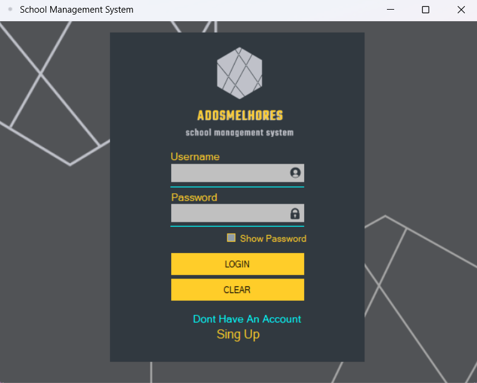
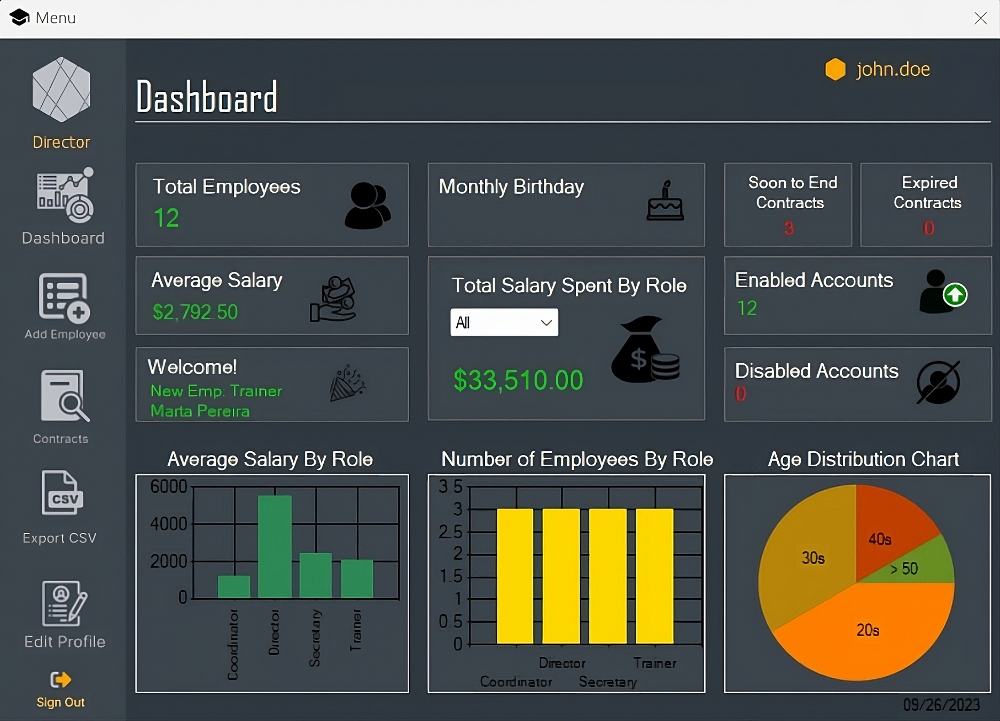
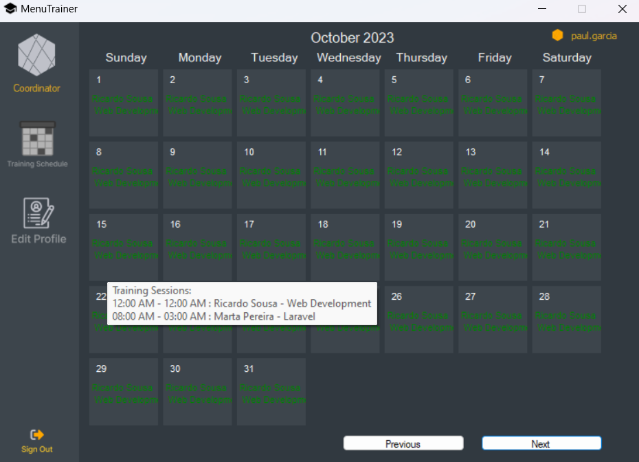

# 🎓 Academia de Formação  Asset Management Application 🎓

<div align="center">
    
</div>

## Project Overview 💻

Welcome to Academia de Formação Asset Management Application, a powerful solution for efficient school management. Whether you're an educational institution or training center, our software streamlines administrative tasks for enhanced productivity.

## Key Features 🔑 📊 📈

1. <u>Hierarchical Roles:</u> Categorize users into roles like Trainee, Trainer, Coordinator, Secretary, and Director for streamlined organization and accountability.

2. <u>Dynamic Account Management:</u> Auto-disable accounts upon contract expiry, awaiting approval by the Director or Secretary.

3. <u>Real-time Insights:</u> Experience real-time data visualization with dynamic charts and graphs, providing instant access to critical information.

4. <u>Comprehensive Contract Management:</u> Efficiently manage contracts, account statuses, and user roles.

5. <u>Easy Employee Management:</u> Seamlessly add new employees with complete details.

6. <u>Data Export:</u> Export data to CSV for easy analysis.

7. <u>Self-Service Profiles:</u> Empower employees to manage their profiles.


## Streamlined Account Creation and Approval: 👍 👎
Our software simplifies account creation for trainees. After submitting the sign-up form, information is recorded. Accounts remain unapproved until verified by the director or secretary, ensuring authorized access. This process fortifies security, thwarts unauthorized entry, and upholds system integrity.

## Director and Secretary Verification: 🔒
Trainee accounts stay unapproved until reviewed by directors or secretaries. This verification ensures exclusive access to genuine users, bolstering system security and protecting sensitive data.

## Restricted Login to Approved Accounts: 🔒
Only accounts approved by directors or secretaries can log in, preserving system security. Access limitations prevent unauthorized users from infiltrating the platform, maintaining confidentiality.

## Empowered Administrative Control: 📕 ✏️
Administrators gain control over authorized access, fostering a user base of genuine individuals. The verification process fosters trust and accountability, aligning with our commitment to a secure school management solution.

Incorporating this feature aligns with modern best practices, enhancing security and access control, and providing a solid foundation for managing school data.

## Conclusion

Our school management software represents an invaluable asset for educational institutions and training centers seeking to optimize their administrative processes. With its feature-rich hierarchy system, account management capabilities, real-time dashboard, comprehensive contract management, and user-friendly interface, our software is tailored to meet the unique demands of educational organizations. Experience enhanced efficiency, data-driven decision-making and streamlined operations, all within a single, powerful solution.


---
<br>

# Installation 🔧 🔨

### Code First Methodology
Our software employs the "Code First" methodology in database design. This approach involves defining the data model using C# classes, referred to as entities. The database schema is then automatically generated based on these classes when the application runs for the first time. This streamlines the process of database creation and management.
 
### Database Context and DbSet
In our application, the Database Context serves as the bridge between the application and the database, our DAL. It's represented by the School class derived from DbContext. DbSet, on the other hand, represents a collection of entities in the context, corresponding to a table in the database. We use DbSet to query and manipulate data.

## Installation Scripts

`Clone the repository`
```bash
git clone https://github.com/ClaudioRSGit/AcademiaDeFormacao.git
```

`Navigate to the project directory`
```bash
cd AcademiaDeFormacao
```

`Build the solution`
```bash
dotnet build
```

`Set the startup project`
```bash
dotnet sln AcademiaDeFormacao.sln add AcademiaDeFormacao/AcademiaDeFormacao.csproj
```

# Note
Make sure you have the required .NET Core SDK installed on your machine. You can download it from the official .NET Core website.

## Usage

### Lets say that you're the Director


`login system`
<br><br>
    

`Main Menu`
<br><br>
    

`Dashboard`
<br><br>
    

`Add Employee`
<br><br>
    

`Contract Management`
<br><br>
    

`Export Data`
<br><br>
    


`Edit Profile`
<br><br>
    

>Director and Secretary can export data in 3 different data types (CSV, XML and JSON)

### Coordinator point of view

`Cordinator Menu`
<br><br>
    


`Calendar`
<br><br>
    


> The Coordinator has access to see all training sessions and also schedule future ones, selecting the start date, end date, trainer and training description.

`Calendar`
<br><br>
    


>Coordinator can hover the training days to check if there ate some other scheduled training sessions.

`Edit Profile`
<br><br>
    


>Coordinators are also able to edit some fields of their own profile.

### Trainer Point of View

`Trainer Menu`
<br><br>
    

`Calendar`
<br><br>
    

>Trainers can only check pre scheduled training sessions

## Class Diagram


## Contact Information 📧

#### For additional support, please contact: 

Cláudio Silva: claudio.silva.t0123173@edu.atec.pt

Gonçalo Moreira: goncalo.moreira.t0123177@edu.atec.pt
